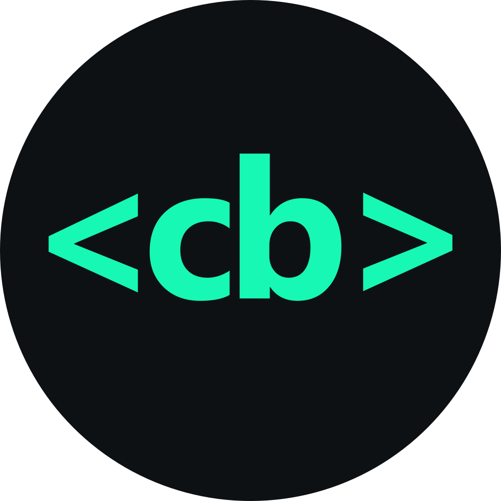

<!-- PROJECT LOGO -->
<br />
<div align="center">
  <a href="https://github.com/jakob-meyer/codebuddy">
    
  </a>

  <h3 align="center">Codebuddy</h3>

  <p align="center">
    Extendable set of tools for web development.
    <br />
    <br />
    <a href="https://jakob-meyer.github.io/codebuddy/">View Project</a>
  </p>
  <p align="center">
    
    
    
    
  </p>
</div>

## Features

### SVG to CSS

Minimizes a SVG using [SVGO](https://github.com/svg/svgo) and converts it to a url encoded CSS string.

## Development

```
npm install
```

### Compiles and hot-reloads for development

```
npm run dev
```

### Compiles and minifies for production

```
npm run build
```

### Lints and fixes files

```
npm run lint
```
